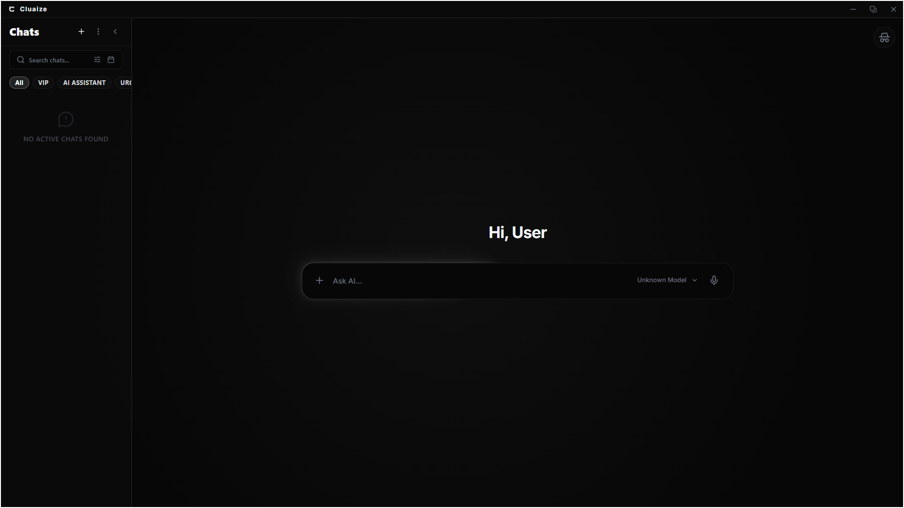
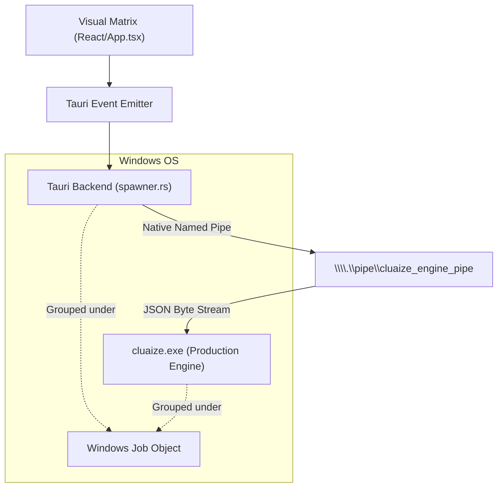

# 🏛️ CLUAIZ CLUAIZD: THE VISUAL MATRIX (FRONTEND MONOREPO)

This is the Tauri-based frontend application for the Cluaize engine, directly connected via Native IPC. 

---

## 🚀 CORE USER FEATURES & FUNCTIONALITIES

The Visual Matrix is a highly customizable, feature-rich interface giving users absolute control over their local AI and chat environment.

### 1. 💬 Rich Conversational Interface
- **New Chat & History:** Seamlessly spin up new conversations or browse through historical interactions directly within the workspace.
- **Emoji & Formatting Support:** Full rendering of emojis, markdown, and formatted text directly inside the message bubbles.
- **Fully Customizable:** Users can personalize their experience by dynamically changing UI themes and chat fonts (`ChatsSettings.tsx`).

### 2. ⚙️ Engine & System Management
- **Booster Settings:** Direct access to granular engine booster settings right from the interface (`EngineSettings.tsx`).
- **Permission Control:** Hardened security features allowing users to toggle what native permissions the engine has access to.
- **API & Server Control:** Spin up the API, manage the native backend server, and monitor engine status straight from the GUI.

### 3. 🔒 Advanced Settings & Shortcuts
- Comprehensive `SettingsOverlay` covering General, Security, Notifications, and Keyboard Shortcuts.
- Granular control over the system without needing to touch a single configuration file.

---

## ⚙️ NATIVE ARCHITECTURE & FFI IPC

Unlike standard web apps, this dashboard does not use WebSockets or standard HTTP to communicate with its backend engine. It utilizes **deep OS-level native integration** via Tauri's Rust backend for absolute zero-latency telemetry stream.

### Deep Technical Breakdown: Engine Connection

The communication between the visual UI and the Cluaize Engine is handled by `src/core/engine/spawner.rs`.

1. **Windows Job Objects (`JOB_OBJECT_LIMIT_KILL_ON_JOB_CLOSE`)**
   The Tauri app does not merely spawn the `cluaize.exe` engine; it rigidly groups the Engine process inside a Windows Job Object. This ensures that the OS treats both processes as a single atomic unit. If the Tauri shell dies, the OS guarantees the Engine dies with it, preventing zombie processes.
   
2. **Native Named Pipes (IPC)**
   The Tauri backend connects to the Engine via a native Windows Named Pipe (`\\.\pipe\cluaize_engine_pipe`) using `tokio::net::windows::named_pipe`. This allows massive throughput of telemetry and AI token generation data at near zero-copy memory speeds, completely bypassing the OS network stack.
   
3. **Event Emitter Bridge**
   The raw byte stream from the pipe is buffered, parsed as JSON lines, and immediately routed to the React frontend via Tauri Events (e.g., `engine_token`, `engine_sys_response`).

---

## 🛑 NATIVE FAILURE STATE & RECOVERY

- **Critical Failure Point (Exit Code `4294967295`):** If the frontend triggers an unhandled memory panic or a catastrophic UI failure, the Tauri App shell will crash with `4294967295` (Generic `-1` Unsigned Error). Because of the Windows Job Object integration, the OS immediately detects the shell termination and forcefully kills `cluaize.exe`. The entire visual matrix safely collapses without leaking resources.
- **IPC Disconnect Recovery:** If the IPC pipe breaks during normal operation without a panic, the frontend catches the disconnect event and transitions into an "Offline Monitor" state. It continuously polls the Named Pipe to reconnect, and synchronizes lost data via CDQL once the engine is resurrected.
